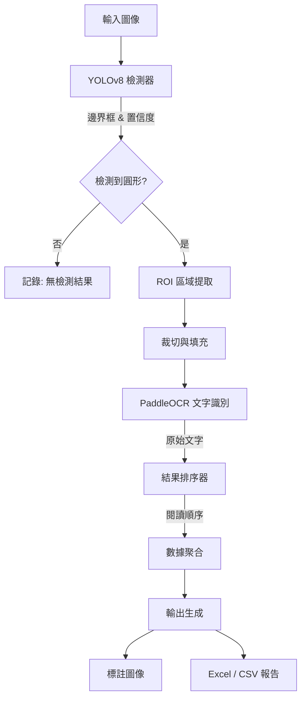

# Circle Label Detector (圓形標籤檢測器)

這是一個自動化圓形標籤檢測與文字提取的完整管線系統，結合了 **YOLOv8** 進行物件檢測以及 **PaddleOCR** 進行高強度的文字識別。專為高準確度與簡易的批量處理而設計。


## 📖 系統概覽 (System Overview)

本系統可處理圖像以識別圓形貼紙或標籤，從中提取文字資訊，並將數據整理為結構化格式（CSV/Excel）。

### 🔄 專案流程 (Pipeline)



### 🧩 模組架構

*   **Detector (`src.detector`)**: 利用自定義訓練的 YOLOv8 模型來尋找圓形感興趣區域 (Region of Interest)。
*   **OCR (`src.ocr`)**: 封裝 PaddleOCR 對裁切後的區域進行文字識別。
*   **Sorter (`src.sorter`)**: 根據空間坐標（從上到下，從左到右）智慧排序檢測到的項目，模擬人類閱讀順序。
*   **Main (`main.py`)**: 管理從輸入到最終導出流程的協調器。

---

## 🚀 快速開始 (Quick Start)

### 1. 前置需求
安裝 **uv** (快速的 Python 套件管理器):
- **macOS**: `brew install uv`
- **Windows**: `pip install uv`

### 2. 安裝專案
```bash
# 克隆存儲庫 (如果適用)
# cd YoloLabs

# 安裝依賴
uv sync
```

### 3. 執行推論
處理 `pic_demo` 資料夾中的所有圖像，並將結果保存到 `result_images`：

```bash
uv run python main.py --input pic_demo --output result_images
```

---

## 📂 文件說明

完整文件位於 `docs` 目錄中：

- [**操作指南 (Usage Guide)**](docs/usage.md): 詳細的安裝說明、指令參數以及 macOS 與 Windows 的故障排除指南。

## 🛠 專案結構

```text
YoloLabs/
├── main.py              # 應用程式入口點
├── pyproject.toml       # 依賴項與專案配置
├── config.yaml          # 配置設定
├── models/              # YOLO .pt 模型存放處
├── src/
│   ├── detector.py      # 物件檢測邏輯
│   ├── ocr.py           # 文字提取邏輯
│   └── sorter.py        # 結果排序邏輯
├── docs/
│   └── usage.md         # 詳細操作指南
└── dataset/             # 訓練數據集 (可選)
```

## 📦 依賴項

主要使用的函式庫：
- `ultralytics`: YOLOv8 實作。
- `paddleocr` / `paddlepaddle`: 光學字元識別。
- `opencv-python`: 圖像處理。
- `pandas` / `openpyxl`: 數據導出。

---
*專為 macOS (Apple Silicon) 和 Windows 平台的高準確度與速度而打造。*
